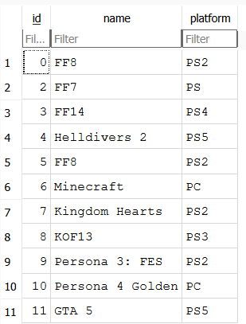
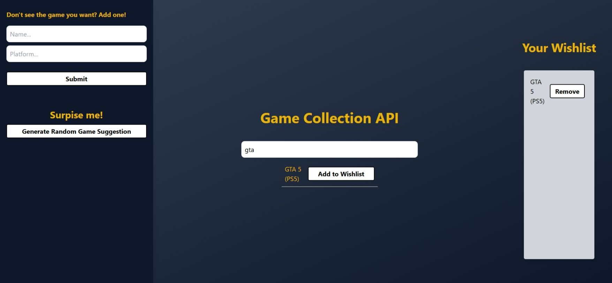

# Game Collection API

## What is this project?
This project uses FastAPI to manage and explore a collection of video games. It was developed for the second Keploy Fellowship Assignment and is fully user-interactive. 

It supports CRUD operations, filtering, keyword search and random game suggestions.

A simple HTML, JavaScript and Tailwind frontend was developed to interact with the API endpoints.

## Project Overview
Frontend: HTML, JavaScript, and Tailwind
Backend: FastAPI and Python
Database: SQLAlchemy

## API Documentation
You can also access endpoint information by typing `localhost:8000/docs` in your browser.

| Method     | Endpoint      | Description   |
|------------|---------------|---------------|
| GET        | /games        | return all games|
| POST       | /games        | add a game |
| GET       | /games/search  | search for a game |
| GET       | /games/{game_id}  | search for a game by id |
| PUT       | /games/{game_id}  | update a game |
| DELETE       | /games/{game_id}  | delete a game |
| GET       | /games/platform/{platform}  | filter by platform |
| GET       | /games/random  | search for a random game |

### Database Schema
The application uses a single `game` table using SQLite.

id: Game id
name: Game names
platform: Game platforms

## Setup Instructions

### 1. Clone Repo
`git clone https://github.com/d-medm/custom-api-server.git`

### 2. Set up environment:
`python -m venv venv`

### 3. Activate
In your terminal, copy and paste:

Windows:
`venv\Scripts\activate`

MacOS:
`source venv/bin/activate`

### 4. Install dependencies: 
`pip install -r requirements.txt`

### 5. IMPORTANT: Configure Environment Variables
Create a .env file to store database url:
`DATABASE_URL=sqlite:///./games.db`

### 6. Run the Server:
`uvicorn main:app --reload`

### 7. Access Frontend
To access the frontend, you can open the `index.html` file using the Live Server extension in VS Code or host it using any simple HTTP server.

## Tests
Tech stack: Pytest, Pytest-mock, SQLAlchemy

### To run the tests:
`pytest`

#### Example output:

### To run coverage:
To install coverage:
`pip install pytest-cov`

Run pytest-cov:
`pytest --cov=app tests/`

#### Example output:

## Keploy Test Report

